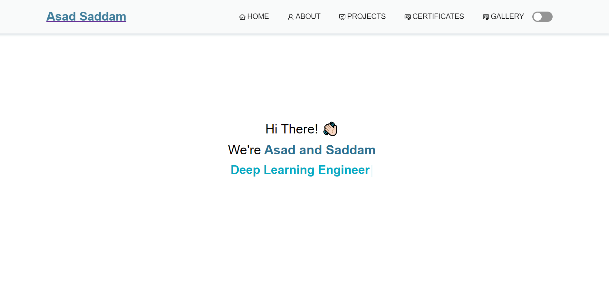

<h2 align="center">
  Portfolio Website  
  
</h2>

  

  

  

  

 

## Built With

Technologies used for this project.

- MongoDb
- Express.js
- React.js
- Node.js

Other tools and platform.
- GitHub
- cloudinary bucket

## Features

**📖 Multi-Page Layout**

**🎨 Styled with React-Bootstrap and Css with easy to customize colors**

**📱 Fully Responsive**

## Getting Started

Clone down this repository. You will need `node.js` and `git` installed globally on your machine.

## 🛠 Installation and Setup Instructions

1. Installation: `npm install`

2. In the project directory, you can run: `npm start`
